# 🏗️ 스마트 견적서 통합 관리 시스템 (Smart Quotation Manager)

본 프로젝트는 여러 포맷의 견적서 파일(PDF, Excel, 구형 XLS, 이미지 등)을 일괄 업로드하여 보관하고, **OCR 및 AI(Gemini 3.5 Flash)**를 통해 핵심 데이터를 자동 추출·형상관리(V1, V2...)하여 최종 엑셀 취합본으로 다운로드하는 통합 내부용 웹 시스템입니다.

---

## 📊 시스템 프로세스 및 데이터 흐름도

GitHub 메인 화면에서 아래 다이어그램을 실시간으로 확인하실 수 있습니다. (Mermaid 지원)

```mermaid
flowchart TD
    %% 스타일 및 테마 정의 (Harmonious Dark Blue 테마)
    classDef user fill:#1e293b,stroke:#475569,color:#f8fafc,stroke-width:2px;
    classDef front fill:#1e3a8a,stroke:#3b82f6,color:#eff6ff,stroke-width:2px;
    classDef back fill:#311042,stroke:#a855f7,color:#faf5ff,stroke-width:2px;
    classDef db fill:#064e3b,stroke:#10b981,color:#ecfdf5,stroke-width:2px;

    %% 1. 사용자 업로드 단계
    Start([견적 취합 시작]) --> Upload["견적서 파일 일괄 업로드 <br>(PDF / XLSX / 구형 XLS / 이미지 최대 100개)"]
    class Start,Upload user;

    %% 2. 프론트엔드 제어 단계 (React / Vite)
    Upload --> ModeCheck{"다중 파일 업로드인가?"}
    ModeCheck -- "Yes (2개 이상)" --> AutoMode["AI 자동 상호 분류 모드 활성화<br>(업체명 직접 입력 비활성화)"]
    ModeCheck -- "No (단일 파일)" --> SingleMode["업체명 직접 입력 가능"]

    AutoMode & SingleMode --> Queue["비동기 동시성 제어 큐 (Queue) 가동<br>(최대 3개 동시 전송 제한 & Rate Limit 방지 1초 딜레이)"]
    Queue --> Request["FastAPI 업로드 API 호출<br>(POST /api/projects/{id}/quotations/upload)"]
    class ModeCheck,AutoMode,SingleMode,Queue,Request front;

    %% 3. 백엔드 전처리 및 파싱 단계 (FastAPI)
    Request --> ExtCheck{"파일 확장자 분석"}
    ExtCheck -- ".xls (구형 엑셀)" --> xlrd["xlrd 파서 작동 (텍스트 스캔)"]
    ExtCheck -- ".xlsx (최신 엑셀)" --> openpyxl["openpyxl (read_only=True) 작동 (수식/텍스트 스캔)"]
    ExtCheck -- ".pdf" --> pdfplumber["pdfplumber 작동 (구조 텍스트 추출)"]
    ExtCheck -- "이미지 (.png/.jpg)" --> OCR["OCR / LLM Vision 작동"]

    xlrd & openpyxl & pdfplumber & OCR --> AISelector{"Gemini API Key 존재 여부"}
    
    %% 4. AI & 로컬 룰베이스 분류 단계
    AISelector -- "있음" --> Gemini["Gemini 3.5 Flash 정밀 파싱<br>(JSON 데이터 구조화 자동 추출)"]
    AISelector -- "없음" --> Regex["로컬 룰베이스 Regex 파서 가동"]

    Gemini & Regex --> DataClean["금액 데이터 정제<br>(숫자 외 텍스트 제거 -> float 변환)"]
    DataClean --> CompanyMapping["제출 업체 상호 최종 판별<br>(입력 상호 -> AI 식별 상호 -> 파일명 순 매핑)"]
    
    class ExtCheck,xlrd,openpyxl,pdfplumber,OCR,AISelector,Gemini,Regex,DataClean,CompanyMapping back;

    %% 5. 형상 관리 및 DB 적재 단계
    CompanyMapping --> ExistCheck{"해당 프로젝트에<br>동일 업체 견적서가 있는가?"}
    ExistCheck -- "없음" --> NewQuotation["신규 견적처 신설<br>(버전 V1 자동 등록)"]
    ExistCheck -- "있음" --> AddVersion["기존 견적처 식별<br>(버전 V+1 자동 누적/적재)"]

    NewQuotation & AddVersion --> SaveDB[("DB 저장 및 파일 서빙 매핑<br>(smart_quotation.db)")]
    class ExistCheck,NewQuotation,AddVersion back;
    class SaveDB db;

    %% 6. 검증 및 수정 단계 (Split-Screen)
    SaveDB --> Verifier["추출 데이터 검증 / 편집 페이지"]
    Verifier --> DocViewer["좌측: 원본 문서 인라인 뷰어 <br>(PDF / Excel / 이미지 뷰포트 렌더링)"]
    Verifier --> EditForm["우측: AI 추출 데이터 검증 폼<br>(금액 필드 3자리 단위 , 자동 표기 마스크)"]
    EditForm --> VerifySubmit["검증 & 최종 승인 처리<br>(is_verified = True 변경)"]
    class Verifier,DocViewer,EditForm,VerifySubmit front;

    %% 7. 테이블 관리 및 결과 출력 단계
    VerifySubmit --> Dashboard["대시보드 취합대장"]
    SaveDB --> Dashboard
    
    Dashboard --> BatchDelete["다중 선택 및 일괄 삭제<br>(DELETE /api/quotations)"]
    BatchDelete --> DiskClean["서버 내 업로드된 물리 파일 동시 삭제"]
    
    Dashboard --> ExcelDownload["통합 엑셀 대장 다운로드<br>(GET /api/projects/{id}/download-excel)"]
    ExcelDownload --> openpyxlGen["openpyxl 스타일링 취합 엑셀 생성"]
    openpyxlGen --> DownloadFile([최종 취합 엑셀 파일 수령])

    class Dashboard,BatchDelete,ExcelDownload,DownloadFile front;
    class DiskClean,openpyxlGen back;
```



---

## 🌟 주요 기능 설명

### 1. 프론트엔드 다중 업로드 & 동시성 제어 큐 (`React + Vite`)
- **자동 분류 모드**: 2개 이상의 다중 파일 드롭 시 "AI 자동 업체 분류 모드"로 자동 스위칭됩니다.
- **동시성 큐**: 최대 100개의 파일도 사용자가 직접 분할할 필요 없이 **최대 3개 동시 전송** 제한 큐를 통해 차례로 순차 처리됩니다.
- **Rate Limit 우회**: 요청 당 1초의 딜레이를 주어 API Rate Limit(429) 에러 발생을 원천 차단합니다.
- **가동 현황**: 게이지 바(ProgressBar)를 통해 전송 진행률을 시각화합니다.

### 2. 하이브리드 파이프라인 파싱 (`FastAPI + Python`)
- **구형 XLS 파일 대응**: `xlrd` 라이브러리를 바인딩해 구형 엑셀 양식 텍스트도 완벽 복원 및 분석합니다.
- **오류 우회**: openpyxl drawings 깨짐 에러(`KeyError: xl/drawings/NULL`) 방지를 위해 `read_only=True` 옵션 및 2차 로드 체인을 제공합니다.
- **AI/룰베이스 자동 스위칭**: `.env`에 `GEMINI_API_KEY`가 감지되면 Gemini 3.5 Flash LLM 파서가 정교하게 작동하며, 없을 경우 로컬 정규표현식(Regex) 룰베이스 파서가 Fallback 기동합니다.

### 3. 정교한 형상관리 버전 누적 및 수정
- **상호명 자동 매칭**: 수동 입력 상호명 -> AI 자동 판별 상호명 -> 파일 이름 순으로 우선 매핑하여 데이터 유실을 차단합니다.
- **버전 누적 (V1, V2...)**: 기존 동일 업체의 견적서가 있을 시 덮어쓰지 않고 최신 정보가 상위 버전으로 순차 적재됩니다.
- **인라인 Split-Screen 뷰어**: 프론트엔드 내에서 원본 파일(엑셀 시트, PDF, 이미지)을 즉각 확인하며 데이터를 검증할 수 있습니다.
- **가독성 포맷팅**: 금액 필드에 천 단위 쉼표(`,`)가 자동으로 마스킹 표기되며, 저장 시에는 숫자로만 정제되어 서버에 안정적으로 전송됩니다.

### 4. 일괄 삭제 및 엑셀 취합
- **로컬 스토리지 클린업**: 대시보드에서 체크박스로 견적서를 삭제하면 DB 데이터뿐 아니라 **서버 디렉토리에 업로드된 실물 파일도 같이 자동 삭제**되어 용량을 최적화합니다.
- **스타일링 엑셀 다운로드**: 통합 엑셀 취합대장은 `openpyxl`을 활용하여 색상 테마 및 정렬 등이 고유 서식 스타일링 처리된 상태로 즉시 다운로드됩니다.

---

## 🚀 로컬 실행 방법

### 백엔드 (FastAPI) 실행
1. 가상환경 및 의존성 라이브러리 설치:
   ```bash
   pip install -r requirements.txt
   ```
2. `.env` 생성 및 `GEMINI_API_KEY` 기재
3. Uvicorn 구동:
   ```bash
   uvicorn backend.app.main:app --reload --port 8000
   ```

### 프론트엔드 (React) 실행
1. 의존성 패키지 설치:
   ```bash
   cd frontend
   npm install
   ```
2. 로컬 개발 서버 구동:
   ```bash
   npm run dev
   ```
3. 웹 브라우저로 `http://localhost:5173` 접속
